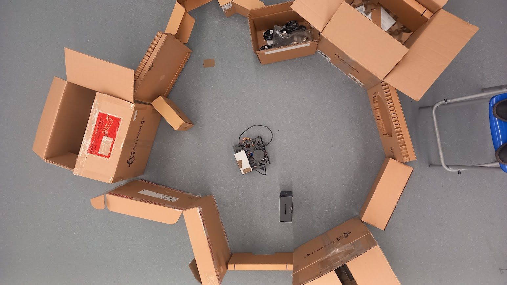
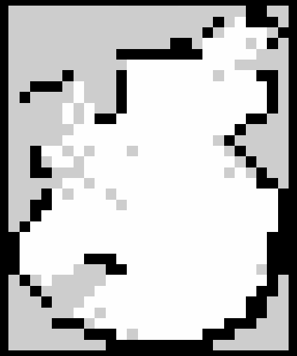
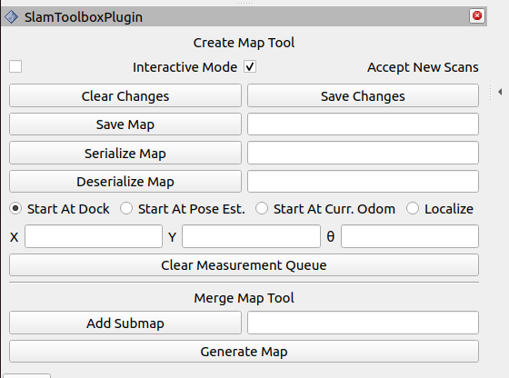

# my_bot

# Networking
<b>Robot</b> <br>
Username: user <br>
password: qwer
hostname: raspberrypi

<b>dev machine</b> (martin-virtual) <br>
username: martin
passworrd: qwer

# Hardware

<b>The lidar and the Arduino are bound to physial usb ports on the Raspberry Pi and must be connected accordng to this diagram. </b>


# dependencies
Dependencies an required packages can be installed using scripts from "config".

*install_dependencies.py* should be run on dev machine.

*install_dependencies_bot.py* should be run on robot itself.


# Launch files
- **rsp.launch.py** - Base launch file for simulation, creates robot description and robot_state_publisher.
- **launch_sim.launch.py** - File for launching robot simulation, launches *rsp.launch.py* and Gazebo.
- **mapping_sim.launch.py** - File for simulating mapping with the robot using slam_toolbox
- **rplidar_bot.launch.py** - File meant to be run on robot itself. Launches rplidar driver that publishes Scan msgs.
- **launch_sim_control.launch.py** - File for launching simulation with ros2 control. For teleop driving topic /cmd_vel must be remapped to /diff_cont/cmd_vel_unstamped

```
ros2 run teleop_twist_keyboard teleop_twist_keyboard --ros-args -r /cmd_vel:=/diff_cont/cmd_vel_unstamped

```
- **launch_robot.launch.py** - File for driving real robot, stars robot_state_publisher, and ros2_control diff_drive. <br> <u>This has to be run on the robot!</u>


# Serial motor demo
Install the following package in your workspace on both dev machine and the robot:

```
git clone https://github.com/joshnewans/serial_motor_demo.git
```

build with colcon and source.

The github page of the package can be found [here](https://github.com/joshnewans/serial_motor_demo)

## Testing functionality
**On robot (ssh) run**

```
ros2 run serial_motor_demo driver --ros-args -p serial_port:=/dev/serial/by-path/platform-fd500000.pcie-pci-0000:01:00.0-usb-0:1.4:1.0 -p baudrate:=57600 -p loop_rate:=30 -p encoder_cpr:=1429
```
*Note:* The name of the serial port is bound to a physical slot on the RasPi!
If using the bigger wheels, the encoder cpr = 10800

**On dev machine**
```
ros2 run serial_motor_demo gui
```

## Manual control
Install python serial terminal
```
pip3 install pyserial
```
Run miniterm
```
python3 -m serial.tools.miniterm /dev/serial/by-path/platform-fd500000.pcie-pci-0000:01:00.0-usb-0:1.4:1.0 57600
```
Set the serial port!

Refer to this repo for instructions [ros-arduino bridge](https://github.com/joshnewans/ros_arduino_bridge/blob/main/README.md)

## ROS - Arduino bridge
Download arduino firmware [here](https://github.com/joshnewans/ros_arduino_bridge/tree/main) and flash it on the Arduino.


# SLAM

## Mapping
To use the robot's lidar for mapping the enviroment, follow these steps:

1. On robot source the workspace and run the default launch file
```
source install/setup.bash
ros2 launch my_bot launch_robot.launch.py
```
For it to launch successfuly, Arduino must be connected and the ROS-Arduino bridge must be flashed. More [here](#ros---arduino-bridge).

2. In new terminal on robot run the RPLidar driver
```
ros2 launch my_bot rplidar_bot.launch.py
```
3. On dev machine, launch slam_toolbox
```
ros2 launch slam_toolbox online_async_launch.py  slam_params_file:=./src/my_bot/config/mapper_params_online_async.yaml 
```
4. launch ``rviz2`` and set fixed_frame to /map

5. Drive the robot around using the teleop node, dont forget to remap /cmd_vel topic
```
ros2 run teleop_twist_keyboard teleop_twist_keyboard --ros-args -r /cmd_vel:=/diff_cont/cmd_vel_unstamped
```

6. When done creating the map, you can save it in rviz using SLAM_toolbox panel that can be added in top left corner menu. Map will be saved in the directory slam toolbox is being run from.



<b>robot enviroment</b>


<b> generated map </b>


<b>Enviroment and map overlayed</b>

## Localizing
When we have a map created, we can load it into RViz and slam will localize the robot against it. 
For doing that the steps are:

1. in [mapper_params_online_async.yaml](config/mapper_params_online_async.yaml) change 'mode' from mapping to localisation, set 'map_file_name' to the path to the map and set 'map_start_at_dock' to true.

2. Place the robot in the enviroment to the same pose where it started when creating the map.

3. Launch robot as described in [mapping](#mapping), launch RViz and add the slam toolbox panel


4. Enter the name of the map to the 'deserialize_map' field and click the button. The previously created map will be loaded and adjusted accroding to the live readings from the lidar.
There is also an option to add new readings to the map or just use it unmodified.


# Lidar
Robot uses RPLidar A1.
To get data from the lidar, use launch file.

```
ros2 launch my_bot rplidar_bot.launch.py
```

## Turn lidar motor off
When lidar driver (launch file) is running, services are available to control the motor.
/stop_motor
/start_motor

To stop motor call service:

```
ros2 service call /stop_motor std_srvs/srv/Empty {}
```

# Gallery


